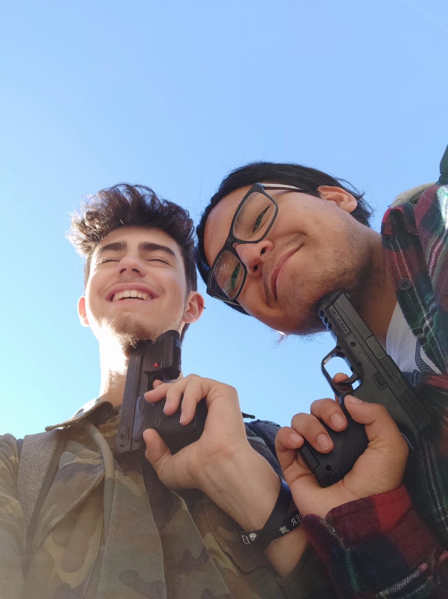

# Welcome to our website! 

## Game description
This is a Platform Game about a jumping slime. Kill enemies, obtain risky coins to get and reach the end if you can! All of this in Slime Fall, a game developed by Little Busters.

## Development team
* [Alejandro Gamarra](https://github.com/alejandro61299) 
 (alejandro61299) - As a Lead Programer & QA
 
* [Marc Gálvez]( https://github.com/optus23) (optus23) - As a Lead Designer & Manager

* [Github repository]( https://github.com/LITTLE-BUSTERS-STUDIO/FallSlime)

* [Trello]( https://trello.com/b/ZRKRIdPU/little-busters)

See also our organization, [Little Busters](https://github.com/LITTLE-BUSTERS-STUDIO)

Currently we are studying VideoGames Design and Development at the "Centre de la Imatge i Multimèdia" (CITM) in Terrassa, Catalonia, Spain. This is our second development project in this degree.

## Litter Busters Team

## Trailer

<iframe width="560" height="315" src="https://www.youtube.com/embed/7XKoazgWiWY" frameborder="0" allow="accelerometer; autoplay; encrypted-media; gyroscope; picture-in-picture" allowfullscreen></iframe>

## Full Walkthrough

<iframe width="560" height="315" src="https://www.youtube.com/embed/4CPGicF9IMY" frameborder="0" allow="accelerometer; autoplay; encrypted-media; gyroscope; picture-in-picture" allowfullscreen></iframe>

## Controls
* A - Move player to the left
* D - Move player to the right
* SPACE - Charged Jump (gummy jump). Also, respawn if slime is dead
* LSHIFT - Special Attack

## Innovation features A1:

* Zoom Debug Mode
* Set Volume Music Up/Down/Mute
* Slime constant mechanic jummping
* Charged jump mechanic (gummy jump)
* Load Animations with Tiled v1.2.0
* Random SFx Jump (4 slime sounds)

## Innovation features A2:

* Camera follow is now smooth
* Camera Tremble when player kill an enemy
* Special Attack mechanic
* God Mode free flying
* Camera pulling, all tilesets out of camera despawn
* Load Entities with tiled v1.2.0

## Innovation features A3
* Personalized Cursor (Blits only in menus)
* Coin entity with Tiled v1.2.0
* Kinesthetic Main menu nevigation
* Tutorial level added
* Different music for each "scene"
* Credits vertical slider
* At the end game your total score is been revealed
* Personalized Icon.ico 

## Download link

Download Slime Fall Releases [here](https://github.com/LITTLE-BUSTERS-STUDIO/SlimeFall/releases/tag/v3.2)

See also our UML System:  [Entities](https://github.com/LITTLE-BUSTERS-STUDIO/SlimeFall/blob/master/docs/UML%20Entity.pdf) -  [UI](https://github.com/LITTLE-BUSTERS-STUDIO/SlimeFall/blob/master/docs/UML%20UI.pdf)

## **We hope you Enjoy! Thanks for playing.**

## Authors Creations
### Marc Galvez: 
1rst Assignment:
* Set volume up/down
* Created Licence
* Player Flips
* Camera follow player
* Level Design
* Animation player with tiled v1.2
* Paralax Background

2nd Assignment:
* God Mode free flying
* Special Attack mechanic 
* Camera Tremble when player kill an enemy
* Camera follow smooth
* Fade to black
* Invulnerability function
* Load parallax improved fot low quality Laptop
* Brofiler added
* F11 to change cap frames ON/OFF
* Animations Enemies: Bat, Skeleton
* Enemy Bat vs Player Logic
* Enemy Skeleton vs Player Logic
* Trello planification
* Changelog and Readme
* UML Entity System

3rd Assignment:
* Personalized Cursor
* Placed and selected music and sfx
* Game Over logic
* Safe Load with button inputs
* Create Pause Menu
* Pause game with dt
* Coin entity
* Animation Coin with Tiled v1.2
* Tutorial level
* Web Page
* Hud  (life and coins)
* UML UI System
* Changed game icon.ico
* Timer and Score

### Alejandro Gamarra : 

1rst Assignment:
* Save & Load logic
* Player movement 
* Load & Unload Levels
* Load colliders with Tiled v1.2
* Collision logic

2nd Assignment:
* Debug pathfinding draw && Walkablemap draw 
* A* algorithm && pathfinding new methods
* Enemy Bat (flyer enemy)
* Entity Manager logic
* Entity && Entity_Info Class 
* Entities Properties System && Classes
* Adapt Player Module to Player Entity
* New solve collision overlap method
* Limit Blit Draw and improve Map Draw
* Framerate Cap 
* Fix several bugs 
* Organize code 

3rd Assignment:
* All GUI Manager logic 
* All Scene Manager logic
* Load & Unload scenes
* Create Main Menu
* Buttons, sliders, panels, panels text, labels , images & checkboxes (logic & art)  
* Tittle art
* Settings logic
* Load & Unload entities
* Organize code 
* Fix several bugs 

~~~~~~~~~~~~~~~
MIT License
Copyright (c) 2018 @alejandro61299 (Alejandro Gamarra Niño) and @optus23 (Marc Gálvez Llorens)
Permission is hereby granted, free of charge, to any person obtaining a copy of this software and associated documentation files (the "Software"), to deal in the Software without restriction, including without limitation the rights to use, copy, modify, merge, publish, distribute, sublicense, and/or sell copies of the Software, and to permit persons to whom the Software is furnished to do so, subject to the following conditions:
The above copyright notice and this permission notice shall be included in all copies or substantial portions of the Software.
THE SOFTWARE IS PROVIDED "AS IS", WITHOUT WARRANTY OF ANY KIND, EXPRESS OR IMPLIED, INCLUDING BUT NOT LIMITED TO THE WARRANTIES OF MERCHANTABILITY, FITNESS FOR A PARTICULAR PURPOSE AND NONINFRINGEMENT. IN NO EVENT SHALL THE AUTHORS OR COPYRIGHT HOLDERS BE LIABLE FOR ANY CLAIM, DAMAGES OR OTHER LIABILITY, WHETHER IN AN ACTION OF CONTRACT, TORT OR OTHERWISE, ARISING FROM, OUT OF OR IN CONNECTION WITH THE SOFTWARE OR THE USE OR OTHER DEALINGS IN THE SOFTWARE.
~~~~~~~~~~~~~~~

